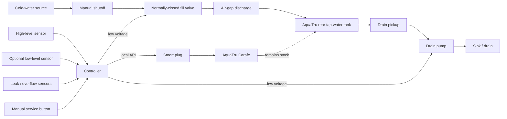
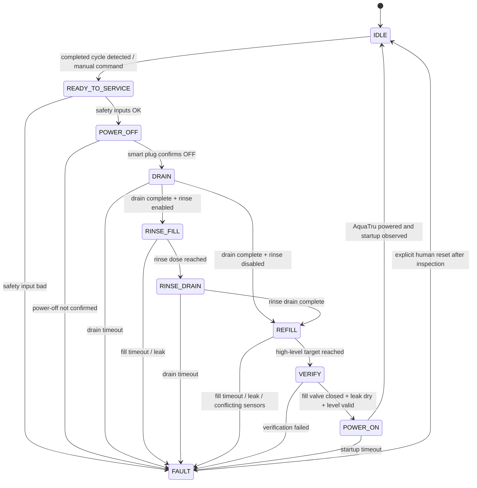

# System design

## Selected architecture

The AquaTru remains unmodified. External hardware handles only housekeeping around the rear tap-water tank and AC power.



The potable-water fill line must terminate **above** the tank's maximum water level so there is a true physical air gap. The fill line should never be submerged.

## Why power goes off first

The chosen service sequence is:

```text
AquaTru reaches completed / refill state
        ↓
CUT AQUATRU POWER
        ↓
Drain concentrated residual
        ↓
Optional dilution rinse
        ↓
Refill with fresh cold tap water
        ↓
Verify level + leak safety
        ↓
RESTORE AQUATRU POWER
        ↓
AquaTru performs a cold boot and evaluates its own sensors
```

This order has several advantages:

- the AquaTru cannot try to run its RO pump while its rear tank is being drained;
- the drain/refill operation lasts much longer than the observed controller-discharge interval, guaranteeing a genuine cold boot;
- no magnetic float spoofing or internal electrical modification is required;
- after power returns, AquaTru's stock firmware still decides whether conditions are safe for filtration.

## Controller state machine



## Triggering a service cycle

### Prototype

Use a physical **SERVICE NOW** button or software command. This keeps early testing deterministic.

### Later automatic trigger

Preferred non-invasive signals:

1. a low-level sensor on the outside of the rear tank, and
2. smart-plug power telemetry showing the AquaTru has returned from filtration power to idle power.

AquaTru documents approximately 36 W maximum power and about 4 W idle draw. Power alone is not a sufficient state signal because several conditions can make the unit idle. A low-level condition plus a completed active-filtration interval is stronger evidence.

Another possible trigger is an optical sensor aimed at the AquaTru **Empty & Refill Tap Tank** indicator. This remains optional.

## Fill control

Primary fill termination should be a high-level sensor positioned at the intended fresh-water fill mark, below the tank handle / normal maximum fill level.

Recommended hierarchy:

```text
normal stop:      high-level sensor
backup stop:      hard maximum fill timer
fault detection:  second overflow/leak sensor
physical safety:  normally-closed water valve
backflow safety:  air gap above tank
```

A flow meter may be added for logging and plausibility checking, but should not be the only protection against overfill.

## Drain control

A peristaltic drain pump is attractive because the fluid touches only tubing, it self-primes, and the pinched tube strongly resists unintended siphoning when the pump is stopped.

The pickup tube should reach the lowest practical point of the tank without interfering with:

- the AquaTru's existing magnetic float,
- the tank's seating/coupling,
- the lid,
- or the normal return flow inside the tank.

For the first prototype, route the pickup over the tank rim rather than drilling the original tank. If a permanent pass-through is eventually desirable, modify a spare lid/tank rather than the only original.

## Optional rinse

AquaTru requires concentrated residual water to be discarded and warns against topping it off. A rinse every cycle does not appear to be required by the owner's manual; normal tank washing and descaling remain separate maintenance tasks.

If testing shows a rinse is useful, implement a **dilution rinse** while the AquaTru is off:

1. drain residual concentrate;
2. add a small measured quantity of fresh water (initial test range: 250–500 mL);
3. optionally allow a short dwell;
4. drain again;
5. perform the normal full refill.

This is not a substitute for periodic manual washing.

## Safety interlocks

The controller must enforce all of the following:

- never power the AquaTru while the drain pump is active;
- never power the AquaTru while the fill valve is open;
- never open the fill valve unless AquaTru power-off has been confirmed;
- immediately close the fill valve on any leak/overflow signal;
- require explicit human reset after a water fault;
- use a hard fill timeout independent of the high-level sensor;
- use a hard drain timeout;
- default all low-voltage outputs OFF at boot;
- require the smart plug to report OFF before water movement begins;
- if network communication with the smart plug is unavailable, abort before draining;
- keep the AquaTru electrically stock.

## Important open behavior to test

The normal AquaTru cycle may finish with the clean-water carafe already full. Before making the refill cycle unattended, verify this exact workflow:

1. allow a normal cycle to finish with the front carafe full;
2. power AquaTru off;
3. drain/refill the rear tank while it remains seated;
4. restore power while the front carafe is still full;
5. confirm AquaTru remains safely idle;
6. empty/reseat the front carafe;
7. confirm filtration begins without requiring another cold boot.

If step 7 fails, the automation should leave AquaTru OFF after refill and perform the cold boot only when the front carafe has been emptied/reseated or when a human requests it.